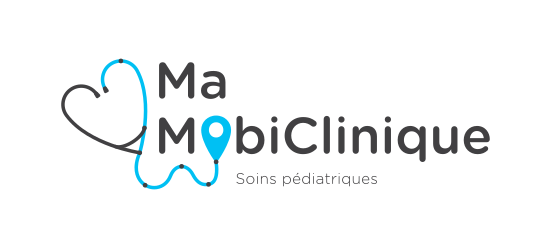

# Blog de Ma MobiClinique (Work in progress)

Ma MobiClinique est un organisme de bienfaisance québécois. Leur mission ? Offrir des services médicaux et psychosociaux aux enfants vulnérables qui n'ont pas autrement acès aux services de santé.

## Le diagnostic

Les tout-petits issus de milieux vulnérables sont plus susceptibles de développer des problèmes de santé. Et souvent, ceux-ci ne sont pas dépistés assez tôt.

Les conséquences néfastes de l’absence de soins pour les tout-petits nuisent à leur épanouissement et représentent un énorme coût social.

Ma MobiClinique s’attaque à ce problème en se déplaçant là où les besoins sont les plus criants.
Ils viennent à la rencontre des familles, notamment grâce à leurs cliniques mobiles sur roues.
S’il vaut mieux prévenir que guérir, mieux vaut également guérir plus tôt que tard.

## Le blog

Le blog de Ma Mobiclinique a pour but de tenir informer les parents sur les avancées pédiatrique et l'actualité de Ma MobiClinique.

[Cliquez ici pour retrouver l'ensemble des éléments visuels de Ma MobiClinique](https://www.behance.net/gallery/78751549/PROJET-INTEGRATEUR-Ma-MobiClinique/modules/478564997)
